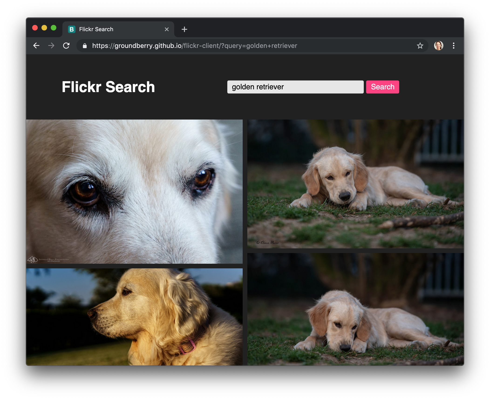
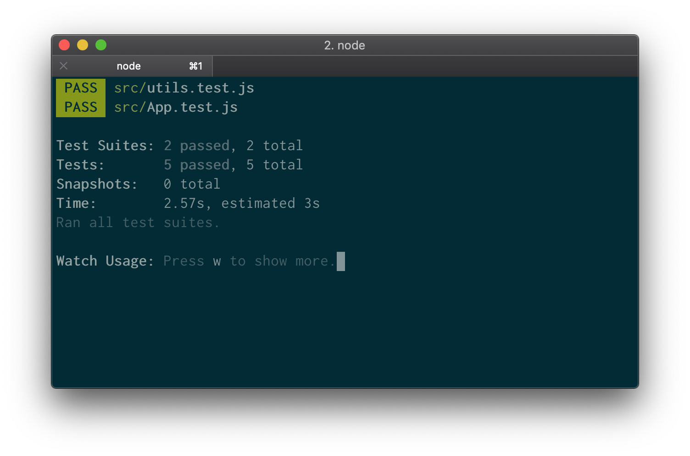

# Flickr Client

An app to easily search images from the [Flickr API](https://www.flickr.com/services/api/) and visualize them nicely in a responsive grid.

## Functionality

- As a user I can see default images if no query is entered on the form.
- As a user I can enter a query.
- As a user I can see images based on the query I entered.
- As a user I can enter a new query on a form.



## Technologies used

The client side of the app is built with [React](https://facebook.github.io/react/). I used [Create React App](https://github.com/facebookincubator/create-react-app) to get it started.

For testing I used [Jest](https://github.com/facebook/jest), and [Enzyme](http://airbnb.io/enzyme/).

I used [Express](https://expressjs.com/), a [Node.js](https://nodejs.org/en/) application framework, to make requests to the Flickr API.

## Challenges

*Dealing with Cross Origin Resource Sharing (CORS)* - Since the front end of the app lived in GitHub pages I had CORS errors when trying to make requests to an external API living in a different domain. So I built a proxy with Express to solve this issue and make sure that the request gets to the API and a response is returned to the client with the desired images.

## Running

Clone this repo:

```
$ git clone https://github.com/groundberry/flickr-client
```

Install all dependancies:

```
$ npm install
```

Start the server:

```
$ npm start
```

## Testing

Run the tests:

```
$ npm run test
```

